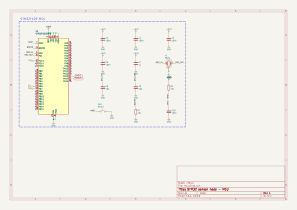
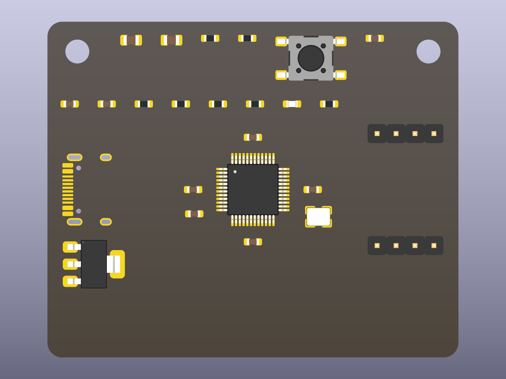

<p align="center">
  
</p>

# lril-kicad-skills

Agent skills that let Claude Code (or any agent that reads `SKILL.md`
files) design real hardware in **KiCad 10**. The agent interviews you until
nothing is assumed, writes the design down, generates schematics, boards,
symbols and footprints from that written spec, and proves every file with
KiCad's own tools (ERC, DRC, netlist export, renders) before it shows you
anything.

Tested against KiCad 10.0.6 on Windows. Linux and macOS paths are handled but
untested.

## Install

Paste this into Claude Code and it will install the skills for you:

```text
Install the KiCad skills from https://github.com/seanrobertwright/lril-kicad-skills:
1. Clone the repo into a temporary folder.
2. Copy every folder under skills/ into my ~/.claude/skills/ directory, side by side
   (kicad, kicad-interview, kicad-parts, kicad-symbol, kicad-footprint, kicad-schematic,
   kicad-pcb, kicad-review, kicad-export). They must stay together because the others
   call ../kicad/scripts/kcs.py.
3. Run: python ~/.claude/skills/kicad/scripts/kcs.py env
   and show me the output. If it reports problems, tell me what to fix.
4. Optional: pip install pdfplumber easyeda2kicad (datasheet pin tables, LCSC parts).
5. Delete the temporary clone.
```

Or, with the skills.sh CLI:

```bash
npx skills add seanrobertwright/lril-kicad-skills
```

Or by hand: clone this repo and copy `skills/*` into `.claude/skills/` of a
project (project-local) or `~/.claude/skills/` (everywhere).

Requirements: KiCad 10 (`kicad-cli` is found automatically, or set
`KICAD_ROOT`), Python 3.10+. Optional: Java for Freerouting,
`pip install pdfplumber` for datasheet pin tables,
`pip install easyeda2kicad` for LCSC symbols/footprints.

## Start a design

Say any of these in Claude Code once the skills are installed:

```text
Let's design a board: an ESP32-C3 sensor node with a BME280, powered from USB-C. Grill me.
```

```text
Make a KiCad symbol and footprint for the TPS7A0233 from its TI datasheet.
```

```text
Review my schematic and board in ./myboard before I order from JLCPCB.
```

The interview skill asks one question at a time, recommends an answer each
time, looks things up instead of asking when it can, and writes every
decision with its source into `design/DESIGN.md` and `design/design.json`.
The schematic and PCB skills build from that spec and verify the result.

## What comes out

A real build of the bundled example (`examples/stm32node/design.json`):
USB-C, AMS1117, STM32F103, crystal, SWD and I2C headers, as three
hierarchical sheets and a 55 x 45 mm two-layer board.

<p align="center">
  
</p>

<p align="center">
  
</p>

Both are produced by `kcs build`, then checked: netlist equals spec, ERC
zero, DRC zero errors, then rendered so the agent (and you) can look at
them. Routing is done by you in KiCad or by Freerouting as a first pass
(`kcs autoroute`).

## The skills

| skill | what it does |
|---|---|
| `kicad` | Core: environment facts, verified KiCad 10 file-format truths, the `kcs` command line and Python library that write and check `.kicad_sch`, `.kicad_pcb`, `.kicad_sym`, `.kicad_mod`, `.kicad_pro` |
| `kicad-interview` | The grill. Twelve phases of questions, one at a time, with recommendations; produces `design/DESIGN.md` and `design/design.json` |
| `kicad-parts` | Resolve every part to symbol + footprint + MPN; LCSC/JLCPCB price, stock and basic/extended lookup (`kcs jlc`); libraries from manufacturer pages, LCSC (easyeda2kicad), SnapEDA, Ultra Librarian, SamacSys |
| `kicad-symbol` | Draft the pin table straight from the datasheet PDF (`kcs pins-from-pdf`), confirm it, generate a KLC-style symbol, look at it (`kcs symview`) |
| `kicad-footprint` | Generate IPC-7351B footprints (chip, gullwing, QFN/DFN, DIP, headers, custom) from package drawings, look at them (`kcs fpview`) |
| `kicad-schematic` | Build the schematic (flat or hierarchical sheets) from the spec, verify netlist == spec, ERC, PDF review loop |
| `kicad-pcb` | Build the board: stackup, outline, holes, placement from interview hints, zones, DRC loop, Freerouting first pass |
| `kicad-review` | Independent checklist review with a findings report |
| `kicad-export` | Gerbers/drill/pos/BOM with JLCPCB, PCBWay, OSH Park presets; STEP, PDF, jobsets |

## How it fits together

```text
interview  ->  design.json + DESIGN.md        (every decision, with its source)
           ->  parts                          (stock libs | manufacturer | LCSC | generate)
           ->  kcs build                      (.kicad_sch, .kicad_pcb, .kicad_pro)
                 netlist == spec?  ERC clean?  PDF looks right?
                 DRC clean?  renders look right?  route (you or Freerouting)
           ->  review report
           ->  fab package (gerbers, drill, pos, BOM, STEP)
```

Everything that KiCad can verify is verified; everything else is written
into DESIGN.md with its source so you can check it.

## The `kcs` command line

`python skills/kicad/scripts/kcs.py <command>` (Python 3.10+, no packages).

| command | purpose |
|---|---|
| `env` | KiCad install, version, library paths |
| `sym search`, `sym info`, `fp search`, `fp info` | find stock and project symbols/footprints; list pins and pads |
| `spec validate`, `build` | check a design spec; build schematic + board + project, then ERC / netlist-vs-spec / DRC / renders |
| `erc`, `drc`, `netlist`, `netcheck` | JSON summaries |
| `render`, `pdf`, `symview`, `fpview` | images the agent looks at |
| `symgen`, `fpgen`, `klc`, `pins-from-pdf` | generate symbols and footprints; KLC checks; datasheet pin tables |
| `fab`, `step`, `autoroute`, `fill`, `upgrade`, `jlc` | manufacturing outputs, Freerouting, zone fill, format upgrade, LCSC lookup |

## Verified facts (KiCad 10.0.6)

File versions: schematic `20260306`, board and footprint `20260206`,
symbol library `20251024`. Boards carry net names, not numbers. Sub-symbols
in `lib_symbols` are unprefixed. Schematic pin transform: flip Y, rotate
counter-clockwise, then mirror. Back-side footprint text: rotation + 180,
`justify mirror`. `kicad-cli` exit 5 = violations, 3 = failed to load.
Evidence and every `kicad-cli` flag are in `skills/kicad/references/`.

## Development

- `tests/` run against a real KiCad 10 install: pin transform for every
  rotation and mirror, pad positions cross-checked with pcbnew, generated
  footprints against stock ones, full flat and hierarchical builds.
- `evals/` hold skill-creator style prompts and expected outcomes per skill.
- `PROMPTS.md` logs every prompt that shaped this repo.

Built with Claude Code. Issues and pull requests welcome.
